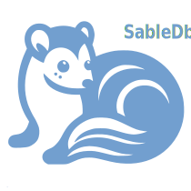

# What is `SableDB`?

`SableDB` is a key-value NoSQL database that utilizes [`RocksDb`][3] as its storage engine and is compatible with the Redis protocol.
It aims to reduce memory costs and increase capacity compared to Redis. `SableDB` features include Redis-compatible access via
any Redis client, up to 64K databases support, asynchronous replication using transaction log tailing and TLS connectivity support.

[3]: https://rocksdb.org/
