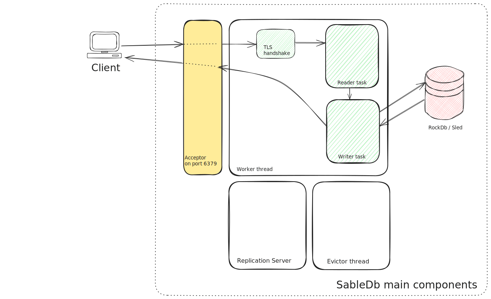

## Overview

This chapter covers the overall design choices made when building `SableDb`.

The networking layer of SableDb uses a lock free design. i.e. once a connection is assigned to a worker thread
it does not interact with any other threads or shared data structures.

Having said that, there is one obvious "point" that requires locking: the storage. 
The current implementation of `SableDb` uses `RocksDb` as its storage engine 
(but it can, in principal, work with other storage engines like [`Sled`][1]), even though
the the storage itself is thread-safe, `SableDb` still needs to provide atomicity for multiple database access (consider the `ValKey`'s
`getset` command which requires to perform both `get` and `set` in a single operation) - `SableDb` achieves this by using a shard locking (more details on this later).

By default, `SableDb` listens on port `6379` for incoming connections. A newly arrived connection is then assigned
to a worker thread (using simple round-robin method). The worker thread spawns a [local task][2] 
(A task, is tokio's implementation for [green threads][3])
which performs the TLS handshake (if dictated by the configuration) and then splits the connection stream into two: 

- Reader end
- Writer end

Each end of the stream is then passed into a newly spawned [local task][2] for handling

Below is a diagram shows the main components within `SableDb`:

## Acceptor thread

The main thread of `SableDb` - after spawning the worker threads - is used as the TCP acceptor thread.
Unless specified otherwise, `SableDb` listens on port 6379. Every incoming connection is moved to a thread
for later handling so the acceptor can accept new connections

## TLS handshake

The worker thread moves the newly incoming connection to a task which does the following:

- If TLS is enabled by configuration, performs the TLS handshake (asynchronously) and split the connection into two (receiver and writer ends)
- If TLS is not needed, it just splits the connection into two (receiver and writer ends)

The TLS handshake task spawns the reader and writer tasks and moves two proper ends of the connection to each of the task.
A tokio channel is then established between the two tasks for passing data from the reader -> writer task

## The reader task

The reader task is responsible for:

- Reading bytes from the stream
- Parsing the incoming message and constructing a `RedisCommand` structure
- Once a full command is read from the socket, it is moved to the writer task for processing

## The writer task

The writer task input are the commands read and constructed by the reader task.

Once a command is received, the writer task invokes the proper handler for that command (if the command it not supported
an error message is sent back to the client). 

The command handler, can return one of 2 possible actions:

### Send a response to the client

There are 2 ways that the writer task can send back a response to the client:

- The command handler returns the complete response (e.g. `+OK\r\n`)
- The command handler writes the response directly to the socket

The decision whether to reply directly or propagate the response to the caller task is done on per command basis.
The idea is to prevent huge memory spikes where possible.

For example, the `hgetall` command might generate a huge output (depends on the number of fields in the hash and their size)
so it is probably better to write the response directly to the socket (using a controlled fixed chunks) rather than building 
a complete response in memory (which can take Gigabytes of RAM) and only then write it to the client.

### Block the client

When a client executes a blocking call on a resource that is not yet available, the writer task is suspended until:

- Timeout occurrs (most blocking commands allow to specify timeout duration)
- The resource is available

[1]: https://sled.rs/
[2]: https://tokio.rs/tokio/tutorial/spawning#tasks
[3]: https://en.wikipedia.org/wiki/Green_thread
