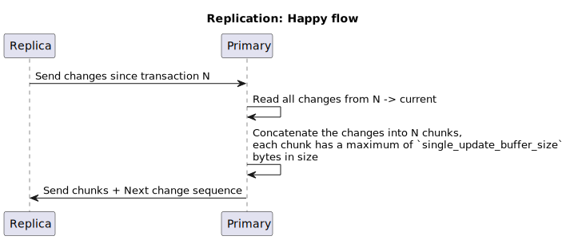
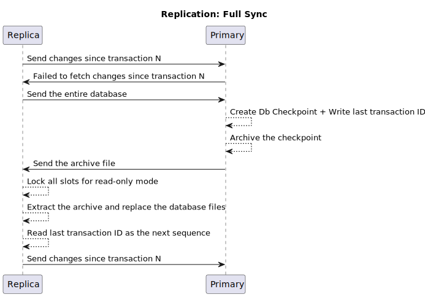

## Overview

`SableDb` supports a `1` : `N` replication (single primary -> multiple replicas) configuration.

The primary server is **stateless** i.e. it does not keep track of its replicas. It is up to replica
server to pull data from the primary and to keep track of the next change sequence ID to pull.

In case there are no changes to send over, the primary server delays the response until something
is available to send over to the replica

The Primary <-> Replica is built using `RocksDb` APIs: [`create_checkpoint`][1] and [`get_updates_since`][2].

In addition, `SableDb` maintains a file named `changes.seq` inside the database folder
which holds the next transaction ID that should be pulled from the primary.

The below sequence of events describes the data flow between the replica and the primary:

When a fullsync is needed, the flow changes to this:

[1]: https://github.com/facebook/rocksdb/wiki/Checkpoints
[2]: https://github.com/facebook/rocksdb/wiki/Replication-Helpers
